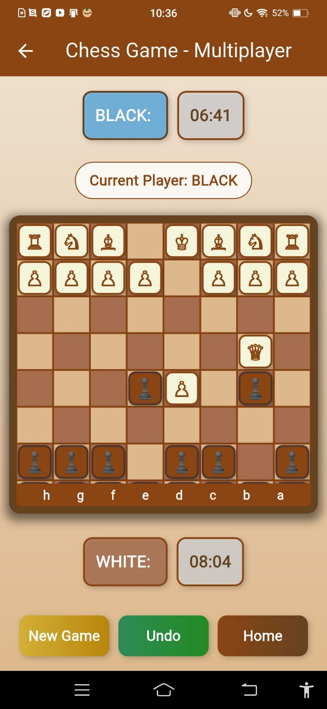
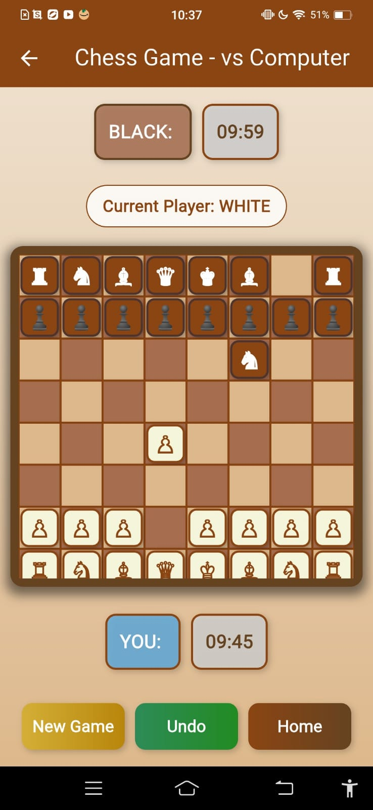

#  Chess Master Pro

> **Elevate Your Chess Game** - A sophisticated mobile chess application with AI opponent and multiplayer support

##  Features

-  **Complete Chess Rules**: All standard chess rules implemented including castling, en passant, and pawn promotion
-  **Multiplayer Mode**: Play against friends on the same device
-  **AI Opponent**: Challenge the computer with adjustable difficulty
-  **Timer**: Built-in chess timer for timed games
-  **Aesthetic Design**: Beautiful wood-themed interface with realistic chess pieces
-  **Mobile Optimized**: Intuitive touch controls designed for mobile devices
-  **Game Analysis**: Review your moves and improve your strategy

##  Download

-  **[Download APK](https://github.com/Yash-007688/chess-game-mobile/releases/latest)** - Direct APK installation file
-  **Source Code** - Clone and build from source

##  Getting Started

### Prerequisites

- Flutter SDK (3.0 or higher)
- Android Studio or VS Code with Flutter plugin
- Android SDK (for Android) or Xcode (for iOS)

### Installation

1. **Clone the repository**
   `ash
   git clone https://github.com/Yash-007688/chess-game-mobile.git
   `

2. **Navigate to the project directory**
   `ash
   cd chess-game-mobile
   `

3. **Install dependencies**
   `ash
   flutter pub get
   `

4. **Run the application**
   `ash
   flutter run
   `

##  How to Play

- **Select Game Mode**: Choose between multiplayer or vs computer from the home screen
- **Move Pieces**: Tap on a piece to select it, then tap on the destination square
- **Game Status**: Current player and timer are displayed at the top of the board
- **Controls**: Use the bottom buttons to start a new game, undo moves, or return to home
- **Valid Moves**: Green highlights show possible moves for selected pieces

##  Tech Stack

| Technology | Purpose |
|------------|---------|
| [Flutter](https://flutter.dev/) | Cross-platform mobile development |
| [Dart](https://dart.dev/) | Programming language |
| [Material Design](https://material.io/) | UI components and design |
| [Git](https://git-scm.com/) | Version control |

##  Project Statistics

-  **Lines of Code**: ~2,000
-  **Files**: ~30
-  **Architecture**: Clean MVC pattern
-  **Testing**: Unit and widget tests included

##  AI Implementation

The computer opponent uses a sophisticated algorithm that:
- Evaluates board positions based on material advantage
- Prioritizes capturing opponent pieces
- Implements basic tactical considerations
- Provides adjustable difficulty levels

##  Contributing

We welcome contributions to make this chess app even better! Here's how you can help:

1.  **Fork** the repository
2.  **Create** your feature branch (git checkout -b feature/AmazingFeature)
3.  **Commit** your changes (git commit -m 'Add some AmazingFeature')
4.  **Push** to the branch (git push origin feature/AmazingFeature)
5.  **Open** a Pull Request

### Development Guidelines

- Follow Flutter's official style guide
- Write unit tests for new features
- Ensure code readability and maintainability
- Update documentation as needed

##  License

This project is licensed under the MIT License - see the [LICENSE](LICENSE) file for details.

##  Contact

**CodeDevPro** - [GitHub Profile](https://github.com/Yash-007688)

Project Link: [https://github.com/Yash-007688/chess-game-mobile](https://github.com/Yash-007688/chess-game-mobile)

##  Support

If you find this project helpful, please give it a star! It helps others discover the project.

##  Acknowledgments

- Thanks to the Flutter community for excellent documentation and resources
- Special thanks to all contributors who help maintain and improve this project
- Chess enthusiasts who provided feedback for game improvements

---

  Made with  using Flutter by <strong>CodeDevPro</strong>

  
  
  

---

##  Screenshots

### Main Menu

### Gameplay

### Checkmate

*Showcasing the clean interface and intuitive design of Chess Master Pro.*---

  Made with  using Flutter by <strong>CodeDevPro</strong>

  
  
  

